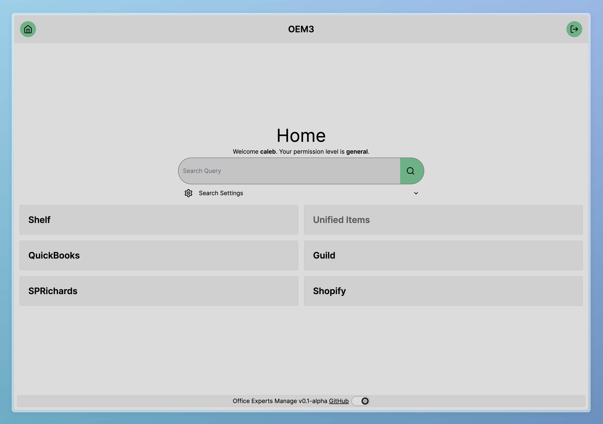

# OEM3

Office Experts Manage 3 is the third iteration of software created to automate processes at Office Experts Incorporated.

This group of projects automates price changes, creates shelf labels faster and automatically, and provides content to [shop.officeexperts.ca](https://shop.officeexperts.ca).

OEM3 is intended to make these processes more reliable, easier to use, and improve website content using new data sources.



## Project Features TODO List

- [x] Authentication
- [x] Data Sources
  - [x] Guild
    - [x] Price File Data
    - [x] Inventory
    - [x] Flyer
    - [x] Enhanced Descriptions
  - [x] SPRichards
    - [x] Price File
    - [x] Etilize Flat File Data
    - [x] Etilize Enhanced Content
  - [x] QuickBooks
  - [x] Shopify
- [x] Search
- [x] Matching
  - [ ] Guild
  - [ ] SPR
  - [ ] Unified Items
- [ ] Exports
  - [ ] QuickBooks Flyer Changes
  - [ ] QuickBooks Price Updates
  - [ ] Shopify Sync
- [x] Shelf Labels
  - [x] Quick Add

## Tech Stack

- TypeScript
- Backend
  - Bun (JavaScript Runtime)
  - tRPC
  - Postgres
  - Docker (hosted on [Railway](https://railway.com))
- Frontend
  - SvelteKit
  - Tailwind

## Development

To install dependencies:

```bash
bun install # run in the project root, /svelte, and /server
```

Ensure all example.env files are updated with development values.
To run in development mode:

```bash
bun run dev # note that docker compose is required to run this
```

## Deployment

Currently, OEM3 is deployed on [Railway](https://railway.com) using a docker image. To build the docker image locally:

```bash
bun run build
```

For a successful deployment, set all environment variables listed in the example.env files. You will also need a separate Postgres database, which can also be hosted on Railway.

## License

This project is _not_ licensed under an open-source license.
